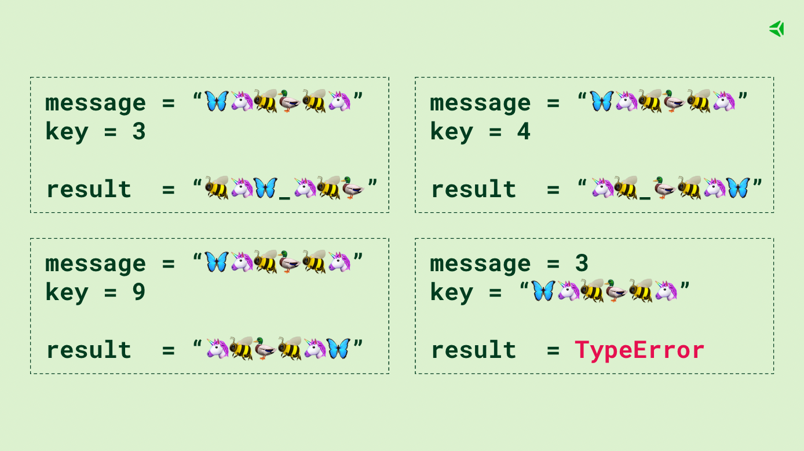

# Boas-vindas ao repositório do projeto `Algorithms`!

Para realizar o projeto, atente-se a cada passo descrito a seguir, e se tiver qualquer dúvida, nos envie por _Slack_! #vqv 🚀

Aqui você vai encontrar os detalhes de como estruturar o desenvolvimento do seu projeto a partir deste repositório, utilizando uma branch específica e um _Pull Request_ para colocar seus códigos.

# Termos e acordos

Ao iniciar este projeto, você concorda com as diretrizes do Código de Conduta e do Manual da Pessoa Estudante da Trybe.

# Entregáveis

<details>
  <summary><strong>🤷🏽‍♀️ Como entregar</strong></summary><br />

  Para entregar o seu projeto você deverá criar um *Pull Request* neste repositório.

  Lembre-se que você pode consultar nosso conteúdo sobre [Git & GitHub](https://app.betrybe.com/course/4d67f5b4-34a6-489f-a205-b6c7dc50fc16/) e nosso [Blog - Git & GitHub](https://blog.betrybe.com/tecnologia/git-e-github/) sempre que precisar!
</details>

<details>
  <summary><strong>👨‍💻 O que deverá ser desenvolvido</strong></summary><br />


  Neste projeto você irá resolver problemas e otimizar algoritmos desenvolvendo a sua capacidade de implementar soluções para os mais diversos problemas do dia a dia!
  
  🚵 Habilidades exercitadas:
  
Lógica;

Capacidade de interpretação de problemas;

Capacidade de interpretação de um código legado;

Capacidade de otimizar a resolução de problemas e;

Resolver problemas/Otimizar algoritmos sob pressão.

</details>

<details>
  <summary><strong>🗓 Data de Entrega</strong></summary><br />
  
  * Este projeto é `individual`;
  * Serão `2` dias de projeto;
  * Data para entrega no prazo regular: `30/03/2023 14:00`.

</details>

# Orientações
<details>
  <summary><strong>⚠️ Antes de começar a desenvolver</strong></summary><br />

  1. Clone o repositório

  - Use o comando: `git clone git@github.com:tryber/sd-022-b-project-algorithms.git`.
  - Entre na pasta do repositório que você acabou de clonar:
    - `cd sd-022-b-project-algorithms`

  2. Crie o ambiente virtual para o projeto

  - `python3 -m venv .venv && source .venv/bin/activate`

  3. Instale as dependências

  - `python3 -m pip install -r dev-requirements.txt`
  
  4. Crie uma branch a partir da branch `main`

  - Verifique que você está na branch `main`
    - Exemplo: `git branch`
  - Se não estiver, mude para a branch `main`
    - Exemplo: `git checkout main`
  - Crie uma branch à qual você vai submeter os `commits` do seu projeto
    - Você deve criar uma branch no seguinte formato: `nome-de-usuario-nome-do-projeto`
    - Exemplo: `git checkout -b joaozinho-sd-022-b-project-algorithms`

  5. Adicione as mudanças ao _stage_ do Git e faça um `commit`

  - Verifique que as mudanças ainda não estão no _stage_
    - Exemplo: `git status` (deve aparecer listada a pasta _joaozinho_ em vermelho)
  - Adicione o novo arquivo ao _stage_ do Git
    - Exemplo:
      - `git add .` (adicionando todas as mudanças - _que estavam em vermelho_ - ao stage do Git)
      - `git status` (deve aparecer listado o arquivo _joaozinho/README.md_ em verde)
  - Faça o `commit` inicial
    - Exemplo:
      - `git commit -m 'iniciando o projeto x'` (fazendo o primeiro commit)
      - `git status` (deve aparecer uma mensagem tipo _nothing to commit_ )

  6. Adicione a sua branch com o novo `commit` ao repositório remoto

  - Usando o exemplo anterior: `git push -u origin joaozinho-sd-022-b-project-algorithms`

  7. Crie um novo `Pull Request` _(PR)_

  - Vá até a página de _Pull Requests_ do [repositório no GitHub](https://github.com/tryber/sd-022-b-project-algorithms/pulls)
  - Clique no botão verde _"New pull request"_
  - Clique na caixa de seleção _"Compare"_ e escolha a sua branch **com atenção**
  - Coloque um título para a sua _Pull Request_
    - Exemplo: _"Cria tela de busca"_
  - Clique no botão verde _"Create pull request"_
  - Adicione uma descrição para o _Pull Request_ e clique no botão verde _"Create pull request"_
  - **Não se preocupe em preencher mais nada por enquanto!**
  - Volte até a [página de _Pull Requests_ do repositório](https://github.com/tryber/sd-022-b-project-algorithms/pulls) e confira que o seu _Pull Request_ está criado

</details>

<details>
  <summary><strong>⌨️ Durante o desenvolvimento</strong></summary><br />

  - Faça `commits` das alterações que você fizer no código regularmente

  - Lembre-se de sempre após um (ou alguns) `commits` atualizar o repositório remoto

  - Os comandos que você utilizará com mais frequência são:
    1. `git status` _(para verificar o que está em vermelho - fora do stage - e o que está em verde - no stage)_
    2. `git add` _(para adicionar arquivos ao stage do Git)_
    3. `git commit` _(para criar um commit com os arquivos que estão no stage do Git)_
    4. `git push -u origin nome-da-branch` _(para enviar o commit para o repositório remoto na primeira vez que fizer o `push` de uma nova branch)_
    5. `git push` _(para enviar o commit para o repositório remoto após o passo anterior)_

</details>

<details>
  <summary><strong>🧱 Estrutura do Projeto</strong></summary><br />

  Este repositório é composto pela pasta `challenges` que contém todos os arquivos que você utilizará neste projeto.

  Cada arquivo `.py`, dentro da pasta `challenges` representa um desafio, ou seja, os arquivos não têm ligação uns com os outros.
  Logo, os problemas devem ser resolvidos de forma separada.

  Este repositório já contém um _template_ com a estrutura de diretórios e arquivos, tanto de código quanto de teste criados. Veja abaixo:

  ```
  .
  ├── challenges
  │   ├──🔹 challenge_anagrams.py
  │   ├──🔸 challenge_encrypt_message.py
  │   ├──🔹 challenge_find_the_duplicate.py
  │   ├──🔹 challenge_palindromes_iterative.py
  │   ├──🔹 challenge_palindromes_recursive.py
  │   └──🔹 challenge_study_schedule.py
  ├── tests
  │   ├── encrypt
  │   │   ├──🔸 __init__.py
  │   │   ├──🔸 conftest.py
  │   │   ├──🔸 mocks.py
  │   │   └──🔹 test_encrypt.py
  │   ├── resultados
  │   │   └──🔸 .gitignore
  │   ├──🔸 __init__.py
  │   ├──🔸 complexities.py
  │   ├──🔸 geradores.py
  │   ├──🔸 marker.py
  │   ├──🔸 test_anagrams.py
  │   ├──🔸 test_find_the_duplicate.py
  │   ├──🔸 test_palindromes_iterative.py
  │   ├──🔸 test_palindromes_recursive.py
  │   └──🔸 test_study_schedule.py
  ├──🔸 dev-requirements.txt
  ├──🔸 pyproject.toml
  ├──🔸 README.md
  ├──🔸 requirements.txt
  ├──🔸 setup.cfg
  ├──🔸 setup.py
  ├──🔸 trybe-filter-repo.sh
  └──🔸 trybe.yml

Legenda:
  🔸 Arquivos que não podem ser alterados.
  🔹 Arquivos a serem alterados para realizar os requisitos.
```

Na estrutura deste _template_, você deve implementar as funções necessárias.
Novos arquivos e funções podem ser criados conforme a necessidade da sua implementação, porém não remova arquivos já existentes.

</details>

<details>
  <summary><strong>🎛 Linter</strong></summary><br />

  Para garantir a qualidade do código, vamos utilizar neste projeto o linter `Flake8`.
  Assim o código estará alinhado com as boas práticas de desenvolvimento, sendo mais legível
  e de fácil manutenção! Para rodá-lo localmente no projeto, execute o comando abaixo:

  ```bash
  python3 -m flake8
  ```

  ⚠️ **PULL REQUESTS COM ISSUES DE LINTER NÃO SERÃO AVALIADAS. ATENTE-SE PARA RESOLVÊ-LAS ANTES DE FINALIZAR O DESENVOLVIMENTO!** ⚠️
</details>

<details>
  <summary><strong>🐍 Versão do Python</strong></summary>
  A versão do Python utilizada neste projeto é a 3.10.6.

  Não se preocupe: você pode continuar desenvolvendo com versões anteriores que tudo deve funcionar corretamente tanto localmente quanto no avaliador remoto.

  Se optar por utilizar a versão 3.10.6 ao invés de versões anteriores, poderá utiliza novas funcionalidades da linguagem durante a resolução dos problemas.

  Você pode aprender a controlar as versões do Python instaladas em sua máquina por meio do [pyenv](https://app.betrybe.com/course/real-life-engineer/python#pyenv-opcional).  
  Para utilizar uma versão específica do Python, você pode utilizar o comando `pyenv local 3.x.y` para especificar uma versão para um diretório e `pyenv global 3.x.y` para especificar a versão do sistema inteiro.
</details>

<details>
  <summary><strong>🏕️ Ambiente Virtual</strong></summary><br />
  O Python oferece um recurso chamado de ambiente virtual que permite sua máquina rodar, sem conflitos, diferentes tipos de projetos com diferentes versões de bibliotecas.

  1. **criar o ambiente virtual**

  ```bash
  $ python3 -m venv .venv
  ```

  2. **ativar o ambiente virtual**

  ```bash
  $ source .venv/bin/activate
  ```

  3. **instalar as dependências no ambiente virtual**

  ```bash
  $ python3 -m pip install -r dev-requirements.txt
  ```

  Com o seu ambiente virtual ativo, as dependências serão instaladas neste ambiente.
  :eyes: Caso precise desativar o ambiente virtual, execute o comando "deactivate". 
  :warning: Lembre-se de ativar novamente quando voltar a trabalhar no projeto.

  O arquivo `dev-requirements.txt` contém todas as dependências que serão utilizadas no projeto, ele está agindo como se fosse um `package.json` de um projeto `Node.js`.
</details>

<details>
  <summary><strong>🛠 Testes</strong></summary><br />

  Para executar os testes certifique-se de que você está com o ambiente virtual ativado.

  <strong>Executar os testes</strong>

  ```bash
  $ python3 -m pytest
  ```

  O arquivo `pyproject.toml` já configura corretamente o pytest. Entretanto, caso você tenha problemas com isso e queira explicitamente uma saída completa, o comando é:

  ```bash
  python3 -m pytest -s -vv
  ```

  Caso precise executar apenas um arquivo de testes basta executar o comando:

  ```bash
  python3 -m pytest tests/nome_do_arquivo.py
  ```

  Caso precise executar apenas uma função de testes basta executar o comando:

  ```bash
  python3 -m pytest -k nome_da_func_de_tests
  ```

  Se desejar rodar os testes de um arquivo específico, execute com `-x nome_do_arquivo`

  ```bash
  python -m pytest -x tests/test_jobs.py
  ```

  Para executar um teste específico de um arquivo, basta executar o comando:

  ```bash
  python -m pytest -x tests/nome_do_arquivo.py::test_nome_do_teste
  ```

  Se quiser saber mais sobre a instalação de dependências com `pip`, veja esse [artigo](https://medium.com/python-pandemonium/better-python-dependency-and-package-management-b5d8ea29dff1).
</details>

<details>
  <summary><strong>🤝 Depois de terminar o desenvolvimento (opcional)</strong></summary><br />

  Para sinalizar que o seu projeto está pronto para o _"Code Review"_, faça o seguinte:

  - Vá até a página **DO SEU** _Pull Request_, adicione a label de _"code-review"_ e marque seus colegas:

    - No menu à direita, clique no _link_ **"Labels"** e escolha a _label_ **code-review**;

    - No menu à direita, clique no _link_ **"Assignees"** e escolha **o seu usuário**;

    - No menu à direita, clique no _link_ **"Reviewers"** e digite `students`, selecione o time `tryber/students-sd-022-b`.

  Caso tenha alguma dúvida veja este [video explicativo](https://vimeo.com/362189205).

</details>

<details>
  <summary><strong>🕵🏿 Revisando um pull request</strong></summary><br />

  Use o conteúdo sobre [Code Review](https://app.betrybe.com/course/real-life-engineer/code-review) para te ajudar a revisar os _Pull Requests_.
</details>

<details>
  <summary><strong>🗣 Nos dê feedbacks sobre o projeto!</strong></summary><br />

Ao finalizar e submeter o projeto, não se esqueça de avaliar sua experiência preenchendo o formulário. 
**Leva menos de 3 minutos!**

[FORMULÁRIO DE AVALIAÇÃO DE PROJETO](https://be-trybe.typeform.com/to/ZTeR4IbH#cohort_hidden=CH22-B&template=betrybe/sd-0x-project-algorithms)

</details>

<details>
  <summary><strong>🗂 Compartilhe seu portfólio!</strong></summary><br />

  Agora que você finalizou os requisitos, chegou a hora de mostrar ao mundo que você aprendeu algo novo! 🚀

   Siga esse [**guia que preparamos com carinho**](https://app.betrybe.com/learn/course/5e938f69-6e32-43b3-9685-c936530fd326/module/a3cac6d2-5060-445d-81f4-ea33451d8ea4/section/d4f5e97a-ca66-4e28-945d-9dd5c4282085/day/eff12025-1627-42c6-953d-238e9222c8ff/lesson/49cb103b-9e08-4ad5-af17-d423a624285a) para disponibilizar o projeto finalizado no seu GitHub pessoal.

   Esse passo é super importante para ganhar mais visibilidade no mercado de trabalho, mas também é útil para manter um back-up do seu trabalho.

   E você sabia que o LinkedIn é a principal rede social profissional e compartilhar o seu aprendizado lá é muito importante para quem deseja construir uma carreira de sucesso? Compartilhe esse projeto no seu LinkedIn, marque o perfil da Trybe (@trybe) e mostre para a sua rede toda a sua evolução.

</details>

# Requisitos Obrigatórios

## 1 - Número de estudantes estudando no mesmo horário (Algoritmo de busca)

Você trabalha na maior empresa de educação do Brasil. Certo dia, a pessoa Product Manager `(PM)` quer saber qual horário tem a maior quantidade de pessoas estudantes acessando o conteúdo da plataforma. Com esse dado em mãos, a pessoa PM saberá qual é o melhor horário para disponibilizar os materiais de estudo para ter o maior engajamento possível.

O horário de entrada e saída do sistema é cadastrado no banco de dados toda vez que uma pessoa estudante entra e sai do sistema. Esses dados estarão contidos em uma lista de tuplas (`permanence_period`) em que cada tupla representa o período de permanência de uma pessoa estudante no sistema com seu horário de entrada e de saída.

Seu trabalho é descobrir qual o melhor horário para disponibilizar os conteúdos de estudo. Para isso, utilize a estratégia de resolução de problemas chamada `força bruta` em que a função desenvolvida por você será chamada várias vezes com valores diferentes para a variável `target_time` e serão analisados os retornos da função.

:eyes: _De olho na Dica:_ O melhor horário será aquele no qual o contador retornado pela função for o maior

<details>
 <summary>
   <b>Clique aqui para ver um exemplo.</b>
 </summary>

```md
# Nos arrays temos 6 estudantes

# estudante             1       2       3       4       5       6
permanence_period = [(2, 2), (1, 2), (2, 3), (1, 5), (4, 5), (4, 5)]

target_time = 5  # saída: 3, pois a quarta, a quinta e a sexta pessoa estudante ainda estavam estudando nesse horário.
target_time = 4  # saída: 3, pois a quinta e a sexta pessoa estudante começaram a estudar nesse horário e a quarta ainda estava estudando.
target_time = 3  # saída: 2, pois a terceira e a quarta pessoa estudante ainda estavam estudando nesse horário.
target_time = 2  # saída: 4, pois a primeira, a segunda, a terceira e a quarta pessoa estudante estavam estudando nesse horário.
target_time = 1  # saída: 2, pois a segunda e a quarta pessoa estudante estavam estudando nesse horário.

Para esse exemplo, depois de rodar a função para todos esses `target_times`, julgamos que o melhor horário é o `2`, pois esse retornou `4`, já que 4 estudantes estavam presentes nesse horário!
```

</details>

- Este requisito será testado executando milhares de vezes sobre várias entradas com o tamanho variável. Tais execuções **no avaliador** irão determinar de maneira empírica, através de cálculos, a complexidade assintótica do seu algoritmo.
  - O tempo de execução do código na sua máquina pode variar em relação ao avaliador, mas o cálculo será feito em cima do comportamento, e não do tempo de execução. Ainda assim, o que vale é o resultado do avaliador, e não o local. Na dúvida, busque ajuda do time de instrução.

- O algoritmo deve utilizar a solução iterativa;

- Caso o `target_time` passado seja nulo, o valor retornado pela função deve ser `None` (considere o horário 0 como um horário válido);

- O código deve ser feito dentro do arquivo `challenges/challenge_study_schedule.py`.

<details>
 <summary>
   <b>🤖 Clique aqui para ver o que será verificado pelo avaliador.</b>
 </summary>

- 1.1 - Retorne a quantidade de estudantes presentes para uma entrada específica;

- 1.2 - Retorne `None` se em `permanence_period` houver alguma entrada inválida;

- 1.3 - Retorne `None` se  `target_time` recebe um valor vazio;

- 1.4 - A função deverá, por meio de análise empírica, se comportar (no avaliador remoto em sua Pull Request) como no máximo O(n), ou seja, com complexidade assintótica linear.

</details>

## 2 - Criptografia de inversões (Testes)

> Implemente em: tests/encrypt/test_encrypt.py

Durante a dinâmica em grupos de um processo seletivo, a empresa contratante definiu um desafio em duplas, e cada pessoa terá um papel. A primeira pessoa deve criar uma função de criptografia, e a segunda pessoa deve implementar os testes da função implementada pela primeira pessoa.

Você fará o papel da _**segunda pessoa**_ nessa dinâmica, ou seja: deve implementar os testes de uma função de criptografia.

Esse teste deve se chamar `test_encrypt_message`, e ele deve garantir que a função de criptografia `encrypt_message` deve respeitar uma lógica específica.

<details>
  <summary>
    <b>🧠 Entenda a lógica da função de criptografia</b>
  </summary>

* Recebe uma string `message` e um inteiro `key` como parâmetros
* Se `key` e `message` não possuírem os tipos corretos, uma exceção deve ser lançada
* Se `key` não for um índice positivo válido de `message`, retorna a string `message` invertida
* Se `key` for ímpar:
  * divide `message` no índice `key`, inverte os caracteres de cada parte, e retorna a união das partes novamente com `"_"` entre elas
* Se `key` for par:
  * divide `message` no índice `key`, inverte a posição das partes, inverte os caracteres de cada parte, e retorna a união das partes novamente com `"_"` entre elas

Veja alguns exemplos:

<p align="center">
    
</p>

</details>

<details>
  <summary>
    <b>📌 Como seu teste é avaliado</b>
  </summary>
  O <strong>teste da Trybe</strong> irá avaliar se o <strong>seu teste</strong> está passando conforme seu objetivo, e confirmará se ele está falhando em alguns casos que deve falhar.
  Para estes testes que esperemos que falhe, o requisito será considerado atendido quando a resposta do Pytest for <code>XFAIL(Expected Fail)</code> ao invés de <code>PASS</code> ou <code>FAIL</code>.
</details>

<details>
  <summary>
    <b>🤖 O que será verificado pelo avaliador</b>
  </summary>

* O teste rejeita implementações que invertem a lógica de "par ou ímpar";
* O teste rejeita implementações que não aplicam a regra de índice positivo válido;
* O teste rejeita implementações que aplicam ordenação ao invés de inversão;
* O teste rejeita implementações que não validam o tipo das entradas;
* O teste aprova implementações corretas.

</details>

## 3 - Palíndromos (Recursividade)

Escreva uma função que irá determinar se uma palavra é um palíndromo ou não. A função irá receber uma string de parâmetro e o retorno será um _booleano_, `True` ou `False`.

Mas o que é um palíndromo?

> Um palíndromo é uma palavra, frase ou número que mantém seu sentido mesmo sendo lido de trás para frente. Por exemplo, `"ABCBA"`. 

:warning: Neste projeto iremos focar somente em **palavras palíndromas** e não em frases ou números.

<details>
 <summary>
   <b>Clique aqui para ver um exemplo.</b>
 </summary>

```md
word = "ANA"
# saída: True

word = "SOCOS"
# saída: True

word = "REVIVER"
# saída: True

word = "COXINHA"
# saída: False

word = "AGUA"
# saída: False
```

</details>

- O algoritmo deve ser feito utilizando a solução recursiva;

- Não se preocupe com a análise da complexidade desse algoritmo;

- Se for passado uma _string_ vazia, retorne `False`;

- O código deve ser feito dentro do arquivo `challenges/challenge_palindromes_recursive.py`.

<details>
 <summary>
   <b>🤖 Clique aqui para ver o que será verificado pelo avaliador.</b>
 </summary>

- 3.1 - Retorne `True` se a palavra passada por parâmetro for um palíndromo;

- 3.2 - Retorne `False` se a palavra passada por parâmetro não for um palíndromo;

- 3.3 - Retorne `False` se nenhuma palavra for passada por parâmetro.

</details>

## 4 - Anagramas (Algoritmo de ordenação)

Faça um algoritmo que consiga comparar duas _strings_, ordená-las e identificar se uma é um anagrama da outra. Ou seja, sua função irá receber duas strings de parâmetro e o retorno da função será uma tupla `()` com a primeira string ordenada, a segunda string ordenada e um _booleano_, `True` ou `False` representando se são anagramas.

O algoritmo deve considerar letras _maiúsculas_ e _minúsculas_ como iguais durante a comparação das entradas, ou seja, ser _case insensitive_. 

Mas o que é um anagrama?

> "Um anagrama é uma espécie de jogo de palavras criado com a reorganização das letras de uma palavra ou expressão para produzir outras palavras ou expressões, utilizando todas as letras originais exatamente uma vez."

<details>
 <summary>
   <b>Clique aqui para ver um exemplo.</b>
 </summary>

```md
first_string = "amor"
second_string = "roma"
# saída: ('amor', 'amor', True)
# Explicação: Nesse caso a palavra 'amor' ordenada continua 'amor' e 'roma' ordenado vira 'amor, além disso a função é True, pois a palavra "roma" é um anagrama de "amor".


first_string = "pedra"
second_string = "perda"
# saída: ('adepr', 'adepr', True)
# Explicação: Nesse caso o retorno também é True. Na palavra "pedra", trocamos o "d" de lugar com o "r" e formamos "perda", sendo assim um anagrama e temos as duas strings ordenadas.


first_string = "pato"
second_string = "tapo"
# saída: ('aopt', 'aopt', True)


first_string = "Amor"
second_string = "Roma"
# saída: ('amor', 'amor', True)
# Explicação: Nesse caso o retorno da função é True, pois a palavra "Roma" é um anagrama de "Amor" independente da letra "R" e "A" serem maiúsculas.


# Agora vamos pra um exemplo em que não existe um anagrama
first_string = "coxinha"
second_string = "empada"
# saída: ('achinox', 'aademp', False)
```

</details>

- Este requisito será testado executando milhares de vezes sobre várias entradas com o tamanho variável. Tais execuções **no avaliador** irão determinar de maneira empírica, através de cálculos, a complexidade assintótica do seu algoritmo.
  - O tempo de execução do código na sua máquina pode variar em relação ao avaliador, mas o cálculo será feito em cima do comportamento, e não do tempo de execução. Ainda assim, o que vale é o resultado do avaliador, e não o local. Na dúvida, busque ajuda do time de instrução;

- Utilize algoritmos de ordenação para realizar este requisito.
  - Você pode utilizar qualquer algoritmo que quiser (_Selection sort_, _Insertion sort_, _Bubble sort_, _Merge sort_, _Quick sort_ ou _TimSort_), desde que atinja a complexidade `O(n log n)`. 
  - :warning: **Dentre esses algoritmos citados acima**, você deve escolher um que atinja a **complexidade** desejada pelo requisito e deverá adequá-lo ao problema. Para isso, você pode se basear nos algoritmos do course ou de alguma fonte de estudo, mas não esqueça de referenciá-la. O uso de funções prontas do Python **não** é permitido.
    - Exemplos de funções prontas do Python não permitidas: _*sort*, *sorted* e *Counter*_;

- :warning: **Não** será permitido realizar nenhuma **importação** neste arquivo!

- A função retorna `True` caso uma _string_ **seja** um anagrama da outra independente se as letras são maiúsculas ou minúsculas;

- A função retorna `False` caso uma _string_ **não seja** um anagrama da outra;

- O código deve ser feito dentro do arquivo `challenges/challenge_anagrams.py`.

<details>
 <summary>
   <b>🤖 Clique aqui para ver o que será verificado pelo avaliador.</b>
 </summary>

- 4.1 - Retorne `True` se as palavras passadas por parâmetro forem anagramas;

- 4.2 - Retorne `False` se as palavras passadas por parâmetro não forem anagramas;

- 4.3 - Retorne `False` se alguma das palavras passadas por parâmetro for uma string vazia;

- 4.4 - A função deverá, por meio de análise empírica, se comportar (no avaliador remoto em sua Pull Request) como no máximo O(n log n), ou seja, com complexidade assintótica linearítmica.

- 4.5 - Retorne `True` se as palavras passadas forem anagramas sem diferenciar maiúsculas e minúsculas.

</details>

---

# Requisitos Bônus

## 5 - Encontrando números repetidos (Algoritmo de busca)

Dada um _array_ de números inteiros contendo `n + 1` inteiros, chamado de `nums`, em que cada inteiro está no intervalo `[1, n]`.

Retorne apenas um número duplicado em `nums`.

<details>
 <summary>
   <b>Clique aqui para ver um exemplo.</b>
 </summary>

```md
nums = [1, 3, 4, 2, 2]
# saída: 2

nums = [3, 1, 3, 4, 2]
# saída: 3

nums = [1, 1]
# saída: 1

nums = [1, 1, 2]
# saída: 1

nums = [3, 1, 2, 4, 6, 5, 7, 7, 7, 8]
# saída: 7
```

</details>

- Caso não passe nenhum valor ou uma string ou não houver números repetidos retorne `False`;

- Este requisito será testado executando milhares de vezes sobre várias entradas com o tamanho variável. Tais execuções **no avaliador** irão determinar de maneira empírica, através de cálculos, a complexidade assintótica do seu algoritmo.
  - O tempo de execução do código na sua máquina pode variar em relação ao avaliador, mas o cálculo será feito em cima do comportamento, e não do tempo de execução. Ainda assim, o que vale é o resultado do avaliador, e não o local. Na dúvida, busque ajuda do time de instrução;

- O array montado deve:

  - Ter apenas números inteiros positivos maiores do que 1;

  - Ter apenas um único número repetindo duas ou mais vezes, todos os outros números devem aparecer apenas uma vez;

  - Ter, no mínimo, dois números.

- O código deve ser feito dentro do arquivo `challenge_find_the_duplicate.py`.

:eyes: **De olho na Dica:** ordene o array.

<details>
 <summary>
   <b>🤖 Clique aqui para ver o que será verificado pelo avaliador.</b>
 </summary>

- 5.1 - Retorne o número repetivo se a função receber como parâmetro uma lista com números repetidos;

- 5.2 - Retorne `False` se a função não receber nenhum parâmetro;

- 5.3 - Retorne `False` se a função receber como parâmetro uma string;

- 5.4 - Retorne `False` se a função receber como parâmetro uma lista sem números repetidos;

- 5.5 - Retorne `False` se a função receber como parâmetro apenas um valor;

- 5.6 - Retorne `False` se a função receber como parâmetro um número negativo;

- 5.7 - A função deverá, por meio de análise empírica, se comportar (no avaliador remoto em sua Pull Request) como no máximo O(n log n), ou seja, com complexidade assintótica linearítmica.

</details>

## 6 - Palíndromos (Iteratividade)

Resolva o mesmo problema apresentado no `requisito 2 - Palíndromos`, porém dessa vez utilizando a solução iterativa.

- Este requisito será testado executando milhares de vezes sobre várias entradas com o tamanho variável. Tais execuções **no avaliador** irão determinar de maneira empírica, através de cálculos, a complexidade assintótica do seu algoritmo.
  - O tempo de execução do código na sua máquina pode variar em relação ao avaliador, mas o cálculo será feito em cima do comportamento, e não do tempo de execução. Ainda assim, o que vale é o resultado do avaliador, e não o local. Na dúvida, busque ajuda do time de instrução;

- O algoritmo deve utilizar a solução iterativa;

- O código deve ser feito dentro do arquivo `challenge_palindromes_iterative.py`.

<details>
 <summary>
   <b>🤖 Clique aqui para ver o que será verificado pelo avaliador.</b>
 </summary>

- 6.1 - Retorne `True` se a palavra passada como parâmetro for um palíndromo, executando uma função iterativa;

- 6.2 - Retorne `True` se a palavra passada como parâmetro for um palíndromo, executando uma função iterativa;

- 6.3 - Retorne `False` se nenhuma palavra for passada como parâmetro, executando uma função iterativa ;

- 6.4 - A função deverá, por meio de análise empírica, se comportar (no avaliador remoto em sua Pull Request) como no máximo O(n), ou seja, com complexidade assintótica linear.

</details>

---
