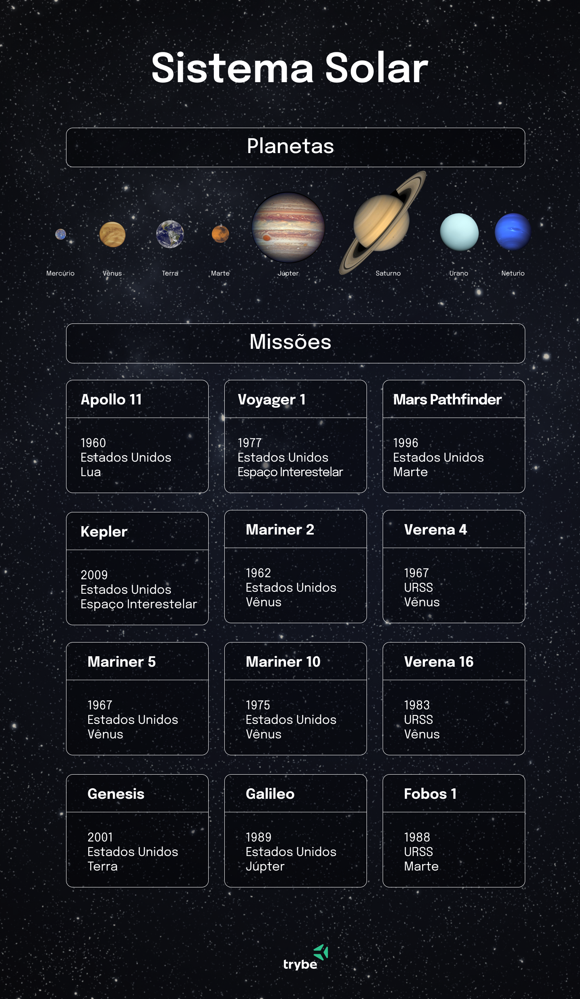

# Trybe Projects
- 🇬🇧 A repository to store the projects made during the Web Development course at Trybe.
- 🇧🇷 Repositório para armazenar os projetos construídos durante a formação de 'Desenvolvimento Web' na Trybe

<details>
<summary><strong>Trybe</strong></summary>

>🇬🇧 "Trybe is a technology school that has a genuine commitment to the professional success of its students. There are more than 1.500 hours of training that covers fundamentals of web development, Front-end, Back-end, computer science, agile methodologies and soft skills."

>🇧🇷 "A Trybe é uma escola de tecnologia que tem comprometimento genuíno com o sucesso profissional das pessoas estudantes. São mais de 1.500 horas de formação que aborda fundamentos de desenvolvimento web, Front-end, Back-end, ciência da computação, metodologias ágeis e habilidades comportamentais."
</details>

<h2>:heavy_check_mark: Fundamentals of Web Development


</h2>

<details>
<summary>:heavy_check_mark: Project - Lessons Learned</summary>
 
##### Habilidades desenvolvidas:
>Um site que contenha uma série de informações. Ele deverá estar com elementos posicionados e estilizados e além disto, deverá conter semântica apropriada para que seja acessível e melhor ranqueado.
##### Print:
 
</details>

<details>
<summary>:heavy_check_mark: Project - Playground Functions</summary>
 
##### Habilidades desenvolvidas:
>Escrever códigos em JavaScript que usam variáveis e tipos primitivos; Utilizar conceitos da linguagem como a tipagem dinâmica e operadores lógicos/aritméticos/de atribuição no seu código; Criar códigos que usam estruturas condicionais, como o if/else; Manipular arrays (listas); Utilizar o comando for; Quebrar grandes problemas em pequenos; Utilizar a lógica de programação na resolução de problemas; Manipular objetos; Utilizar o comando for/in; Utilizar funções para organizar e estruturar o seu código.
</details>

<details>
<summary>:heavy_check_mark: Project - Pixels Art</summary>
 
##### Habilidades desenvolvidas:
>Manipular o DOM para implementar uma página web que contém uma paleta de cores funcional que poderá ser utilizada para criar desenhos em pixels. Para isto você irá utilizar javascript, css e html.
##### Print:
 
</details>

<details>
<summary>:heavy_check_mark: Project - To-do List</summary>
 
##### Habilidades desenvolvidas:
>Será desenvolvido uma lista de tarefas usando HTML, CSS e JavaScript.
##### Print:
 
</details>

<details>
<summary>:heavy_check_mark: Project - Color Guess</summary>
 
##### Habilidades desenvolvidas:
>Nesta aplicação deverá ser criado um jogo de adivinhação de cores, em que o usuário deve clicar na cor correta dentro de uma paleta aleatória. A pontuação deverá atualizar de acordo com os acertos.
##### Print:
 
</details>

<details>
<summary>:hourglass_flowing_sand: Project - Meme Generator</summary>
 
##### Habilidades desenvolvidas:
>Manipular o DOM para criar um site onde é possível fazer o upload de fotos para gerar memes personalizados.
##### Exemplo:
 
</details>

<details>
<summary>:hourglass_flowing_sand: Project - Mistery Letter</summary>
 
##### Habilidades desenvolvidas:
>Utilizando JavaScript, HTML5 e CSS3, será desenvolvida uma aplicação que gere cartas misteriosas, em que todos os elementos (cores, imagens, propriedades de fontes, etc) são gerados aleatóriamente.
##### Exemplo:
 
</details>

<details>
<summary>:heavy_check_mark: Project - Trybewarts</summary>
 
##### Habilidades desenvolvidas:
>Neste projeto, você irá desenvolver uma página de formulário HTML; Utilizar CSS Flexbox para criar layouts flexíveis; Criar regras CSS específicas para serem aplicadas a dispositivos móveis.
##### Exemplo:
 
</details>

<details>
<summary>:heavy_check_mark: Project - JavaScript ES6 Unit Tests</summary>
 
##### Habilidades desenvolvidas:
>Escrever testes unitários utilizando o módulo Jest do NodeJS para verificar o correto funcionamento das funções; implementar várias funções na resolução dos requisitos propostos e/ou testes unitários para garantir que as implementações das funções estão corretas, de acordo com o que está sendo solicitado em cada enunciado.
</details>

<details>
<summary>:heavy_check_mark: Project - Zoo functions</summary>
 
##### Habilidades desenvolvidas:
>Aprimorar as habilidades com ES6, aplicando e combinado HOFs (Higher Order Functions) e desenvolvendo testes unitários.
</details>

<details>
<summary><h4>Curriculum / Currículo</h4></summary>

#### Unit 01: Unix & Bash
- Unix & Bash - Part 1
- Unix & Bash - Part 2
 
#### Unit 02: Git, GitHub, and Internet
- Git & GitHub - What they are and what they are used for
- Git & GitHub - Understanding the commands
- Internet - Understanding how it works
 
 #### Unit 03: Introduction to HTML e CSS
- HTML & CSS - Page stucture
- HTML & CSS - First steps with CSS
- HTML & CSS - Selectors and positioning
- Semantic HTML
- ☑️ **Project - Lessons Learned**

 #### Unit 04: Introduction to JavaScript
- JavaScript - First steps
- JavaScript - Array and For loop
- JavaScript - Programming Logic and Algorithms
- JavaScript - Objects and Functions
- ☑️ **Project - Playground Functions**

#### Unit 05: JavaScript - DOM, Events and Web Storage
- JavaScript - DOM and selectors
- JavaScript - Working with elements
- JavaScript - Events
- JavaScript - Web Storage
- ☑️ **Project - Pixels Art**
- ☑️ **Project - To-do List**
 
#### Unit 06: HTML & CSS: Forms, Flexbox, and Responsiveness
- HTML & CSS - Forms
- JavaScript Libraries and CSS Frameworks
- Introduction - Flexbox CSS
- Flexbox CSS - Part 1
- Flexbox CSS - Part 2
- CSS Responsive - Mobile First
- ☑️ **Project - Trybewarts**
  
#### Unit 07: Introduction to JavaScript ES6 and Unit Tests
- JavaScript ES6 - let, const, arrow functions, and template literals
- JavaScript ES6 - Exception flow and Objetcs
- First steps with Jest
- ☑️ **Project - JavaScript ES6 Unit Tests**

#### Unit 08: JavaScript ES6 Higher-Order Functions
- JavaScript ES6 - Introduction to Higher-Order Functions
- JavaScript ES6 - Higher-Order Functions - forEach, find, some, every, sort
- JavaScript ES6 - Higher-Order Functions - map e filter
- JavaScript ES6 - Higher-Order Functions - reduce
- JavaScript ES6 - spread operator, rest parameter, destructuring and more
- ☑️ **Project - Zoo functions**
</details>

<h2>:heavy_check_mark: Front-end Development


</h2>

<details>
<summary>:heavy_check_mark: Project - Shopping Cart</summary>

 ##### Habilidades desenvolvidas:
>Você vai desenvolver carrinho de compras totalmente dinâmico! Para isso, vai consumir dados diretamente de uma API!
##### Print:

</details>

<details>
<summary>:heavy_check_mark: Project - Solar System</summary>

 ##### Habilidades desenvolvidas:
>Neste projeto, verificamos se você é capaz de utilizar JSX no React; Utilizar corretamente o método render() para renderizar seus componentes; Utilizar import para trazer componentes em diferentes arquivos; Criar componentes de classe em React; Criar múltiplos componentes a partir de um array; Fazer uso de props corretamente; Fazer uso de PropTypes para validar as props de um componente.
##### Exemplo:

</details>
<details>
<summary>:heavy_check_mark: Project - Tryunfo</summary>

 ##### Habilidades desenvolvidas:
>Neste projeto você vai desenvolver um jogo no estilo Super Trunfo! Ao utilizar essa aplicação uma pessoa usuária deverá ser capaz de criar um baralho com o tema livre; Adicionar e remover uma carta do baralho; Visualizar todas as cartas que foram adicionadas ao baralho.
>Neste projeto, foi possível ler o estado de um componente e usá-lo para alterar o que exibimos no browser; Inicializar um componente, dando a ele um estado pré-definido; Atualizar o estado de um componente; Capturar eventos utilizando a sintaxe do React; Criar formulários utilizando sintaxe JSX; Transmitir informações de componentes filhos para componentes pais via callbacks.
##### Print:

</details>
<details>
<summary>:heavy_check_mark: Project - TrybeTunes</summary>

 ##### Habilidades desenvolvidas:
>Neste projeto você irá criar uma aplicação capaz de reproduzir músicas das mais variadas bandas e artistas, criar uma lista de músicas favoritas e editar o perfil da pessoa usuária logada.
>Neste projeto, foi possível fazer requisições e consumir dados vindos de uma ```API```; Utilizar os ciclos de vida de um componente React; Utilizar a função setState de forma a garantir que um determinado código só é executado após o estado ser atualizado; Utilizar o componente BrowserRouter corretamente; Criar rotas, mapeando o caminho da URL com o componente correspondente, via Route; Utilizar o Switch do React Router; Criar links de navegação na aplicação com o componente Link.
##### Exemplo:

</details>
<details>
<summary>:heavy_check_mark: Project - Front-end Online Store</summary>

 ##### Habilidades desenvolvidas:
>Neste projeto você criará uma versão simplificada, sem persistência no banco de dados, de uma loja online. Teremos uma aplicação em que pessoas usuárias poderão buscar produtos por termos e categorias a partir da ```API do Mercado Livre```; interagir com os produtos buscados de modo a adicioná-los e removê-los de um carrinho de compras em diferentes quantidades; Visualizar detalhes e avaliações prévias de um produto.
##### Print:

</details>
<details>
<summary>:heavy_check_mark: Project - Tests with React</summary>

 ##### Habilidades desenvolvidas:
>Nesse projeto você escreverá testes para uma aplicação React que já está criada e configurada, utilizando ```Jest e a biblioteca React Testing Library```.
</details>
<details>
<summary>:heavy_check_mark: Project - Trybe Wallet</summary>

 ##### Habilidades desenvolvidas:
>Neste projeto você vai desenvolver uma carteira de controle de gastos com conversor de moedas, ao utilizar essa aplicação um usuário poderá adicionar, remover e editar um gasto; Visualizar uma tabelas com seus gastos; Visualizar o total de gastos convertidos para uma moeda de escolha.
>Neste projeto, foi possível trabalhar com os elementos da biblioteca ```Redux em aplicações React```. Foi feito o uso da store; reducers; actions; dispatchers; actions assíncronas.
##### Exemplo:

</details>
<details>
<summary>:heavy_check_mark: Project - Trivia Game</summary>

 ##### Habilidades desenvolvidas:
>Foi desenvolvido um jogo de perguntas e respostas baseado no jogo Trivia utilizando React e Redux.
##### Print:

</details>
<details>
<summary>:heavy_check_mark: Project - StarWars Datatable with Context API and Hooks</summary>

 ##### Habilidades desenvolvidas:
>Foi desenvolvido uma aplicação com uma lista com filtros de planetas do universo de Star Wars usando ```Context API e Hooks``` para controlar os estados globais.
>Nesse projeto foi possível utilizar a Context API do React para gerenciar estado; Utilizar Hooks, como: useState; useContext; useEffect; Criar React Hooks customizados; Escrever testes para garantir que a aplicação possua uma boa cobertura de testes.
##### Exemplo:

</details>
<details>
<summary>:heavy_check_mark: Project - Recipes App</summary>

 ##### Habilidades desenvolvidas:
>Foi desenvolvido um app de receitas, utilizando o que há de mais moderno dentro do ecossistema React: Hooks e Context API! Nele é possível: ver, buscar, filtrar, favoritar e acompanhar o progresso de preparação de receitas e drinks! Para a base de dados serão ```2 APIs``` distintas.
##### Print:

</details>

<details>
<summary><h4>Curriculum / Currículo</h4></summary>

#### Unit 09: JavaScript and Asynchronous Tests
- Introduction to Front-end development - Part 1
- Asynchronous JavaScript and Callbacks - Part 2
- Asynchronous JavaScript - Fetch API, and async/await
- Jest - Asynchronous Tests
- ☑️ **Project - Shopping Cart**

#### Unit 10: Introduction to React
- Introdução - React
- 'Hello, world!' no React!
- Componentes React
- ☑️ **Project - Sistema Solar**
  
#### Unit 11: Components with State, Events, and Forms with React
- Components with state and events
- Forms with React
- ☑️ **Project - Tryunfo**
  
#### Unit 12: Components Lifecycle and React Router
- Components Lifecycle
- React Router
- ☑️ **Project - TrybeTunes**

#### Unit 13: Agile Methodologies
- Agile Methodologies
- ☑️ **Project - Front-end Online Store**
 
#### Unit 14: Automated testing with React Testing Library
- RTL - First Steps
- RTL - Mocks and Inputs
- RTL - Testing React Router
- ☑️ **Project - Tests with React**

#### Unit 15: State management with Redux
- Introduction to Redux - the global application state
- Using Redux with React
- Using Redux with React - Asynchronous Actions
- Tests with React-Redux
- ☑️ **Project - Trybe Wallet**

#### Unit 16: Project - Trivia Game
- ☑️ **Project - Trivia Game**

#### Unit 17: Context API and React Hooks
- React Context API
- React Hooks - useState and useContext
- React Hooks - useEffect and custom Hooks
- ☑️ **Project - StarWars Datatable with Context API and Hooks**

#### Unit 18: Project - Recipes App
- ☑️ **Project - Recipes App**
 </details>

<h2>:hourglass_flowing_sand: Back-end Development


</h2>
	
<details>
<summary>:heavy_check_mark: Project - Docker To-do List</summary>
 
##### Habilidades desenvolvidas:
>Neste projeto foi utilizado o Docker para: Conteinerizar aplicações; Criar uma conexão entre elas; Orquestrar seu funcionamento.
</details>

<details>
<summary>:heavy_check_mark: Project - All For One</summary>
 
##### Habilidades desenvolvidas:
>Neste projeto foi utilizado o banco de dados ```Northwind``` para realizar queries ```SQL``` de diferentes níveis de complexidade.
</details>

<details>
<summary>:heavy_check_mark: Project - One For All</summary>
 
##### Habilidades desenvolvidas:
>Este projeto foi uma extensão do projeto anterior. Desta vez foi necessário normalizar, modelar e popular uma tabela, para então realizar queries ```SQL``` com complexidade ainda maior.
Print:

</details>
	
- :hourglass: **Project - Talker Manager**
- :hourglass: **Project - Store Manager**
- :hourglass: **Project - Blogs API**
- :hourglass: **Project - Stranger Things**
- :hourglass: **Project - Trybe Smith**
- :hourglass: **Project - Trybers and Dragons**
- :hourglass: **Project - TFC - Trybe Soccer Team**
- :hourglass: **Project - Commerce**
- :hourglass: **Project - Car Shop**
- :hourglass: **Project - Delivery App**

<details>
<summary><h4>Curriculum / Currículo</h4></summary>

#### Unit 19: Docker: Using Containers
- Introduction - Back-end
- Using Containers - Docker
- Manipulation and Creation of Images with Docker
- Orchestrating Containers with Docker Compose
- **Project - Docker To-do List**

#### Unit 20: Introduction to SQL
- Introduction - Relational Databases
- SQL Databases
- Finding data in a database
- Filtering data in specific ways
- Manipulating tables
- **Project - All For One**

#### Unit 21: SQL Functions, JOINs e Normalization
- Most used SQL functions
- Simplifying JOINs
- Turning ideas into a database model
- **Project - One For All**

#### Unit 22: Introduction to Web Development with Node.js
- Intro - Node.js
- Node.js - An JavaScript engine
- Node.js - Asynchronous Flow
- Mocha, Chai and Sinon - Back-end Tests with Node.js
- Express - HTTP with Node.js
- Express - Middlewares
- **Project - Talker Manager**

#### Unit 23: Node.js: Service Layer, Rest Architecture, and Restful
- Introduction to - Software Architecture
- Software Architecture - Model Layer
- Software Architecture - Controller and Service Layers
- Web Architecture - Rest and Restful
- Software Architecture - Testing the Layers
- **Project - Store Manager**

#### Unit 24: Node.js: ORM and Autentication
- Introduction - Node.js: ORM and Autentication
- ORM - Application interface with the database
- ORM - Associations
- JWT - (JSON Web Token)
- Testing APIs with Integration Tests
- **Project - Blogs API**

#### Unit 25: Deployment
- Introduction - Deploy
- Infrastructure - Deploy with Heroku
- Deploy Docker & Heroku
- **Project - Stranger Things**

#### Unit 26: TypeScript
- Introduction - TypeScript
- Introduction to TypeScript
- Static typing and Generics
- Express with TypeScript
- **Project - Trybe Smith**
  
#### Unit 27: Object-Oriented Programming (OOP) and SOLID
- Introduction to Object-Oriented Programming
- Inheritance and Interfaces
- Polymorfism
- SOLID - Introduction
- SOLID - Continuation
- **Project - Trybers and Dragons**

#### Unit 28: **Project - TFC - Trybe Soccer Team
- **Project - TFC - Trybe Soccer Team**

#### Unit 29: Introduction to MongoDB
- Introduction - NoSQL
- MongoDB - Introduction
- Filter Operators
- Query operators
- Simple Updates
- Complex Updates - Arrays
- **Project - Commerce**
  
#### Unit 30: MongoDB with Node.js and OOP
- MongoDB and MSC architecture
- MongoDB and OOP
- **Project - Car Shop**

#### Unit 31: **Project - Delivery App
- **Project - Delivery App**

#### Unit 32: MasterClass - VPS, CI/CD
- Day 1
- Day 2
 </details>

<h2>:hourglass: Computer Science

</h2>

- :hourglass: **Project - Job Insights**
- :hourglass: **Project - Inventory Reports**
- :hourglass: **Project - Tech news**
- :hourglass: **Project - Algorithms**
- :hourglass: **Project - TING - Trybe Is Not Google**
- :hourglass: **Project - Restaurant Orders**

<details>
<summary><h4>Curriculum / Currículo<h4></summary>

#### Unit 33: Introduction to Python
- Introduction to - Computer Science
- Learning Python
- Data Input and Output
- Tests
- **Project - Job Insights**

#### Unit 34: Design Patterns
- Object-Oriented Programming Introduction
- Patterns - Iterator, Adapter, Strategy
- Patterns - Decorator, Observer, Factory
- **Project - Inventory Reports**
 
#### Unit 35: Networks and Data Scraping
- Network architecture, tools and security
- Data Scraping
- **Project - Tech news**

#### Unit 36: Algorithms
- Algorithms complexity
- Recursiveness and problem solving strategies
- Sorting and search Algorithms
- **Project - Algorithms**
  
#### Unit 37: Data Structure I: Arrays, Lists, Queues and Stacks
- Computer Architecture
- Arrays
- Node and Linked Lists
- Stacks and Queues
- **Project - TING - Trybe Is Not Google**
  
#### Unit 38: Data Structure II: Arrays, Hashmaps, and Sets
- Hashmap and Dict
- Set
- **Project - Restaurant Orders**
 </details>
